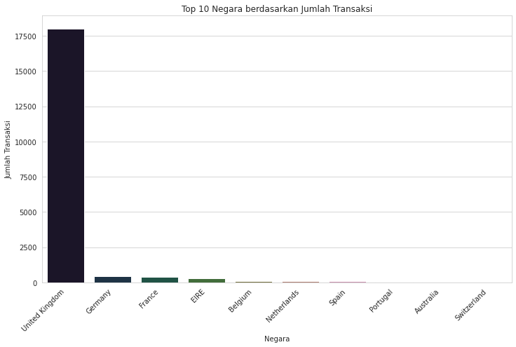

# Online Retail Exploratory Data Analysis with Python


## Daftar Isi

1.  [Pendahuluan Proyek](#1-pendahuluan-proyek)
2.  [Studi Kasus & Tujuan](#2-studi-kasus--tujuan)
3.  [Dataset](#3-dataset)
4.  [Tahapan Analisis & Temuan Utama](#4-tahapan-analisis--temuan-utama)
    * [Pembersihan Data](#pembersihan-data)
    * [Statistik Dasar](#statistik-dasar)
    * [Analisis Tren Penjualan](#analisis-tren-penjualan)
    * [Analisis Performa Produk](#analisis-performa-produk)
    * [Analisis Geografi & Pelanggan](#analisis-geografi--pelanggan)
    * [Identifikasi Outlier & Anomali](#identifikasi-outlier--anomali)
5.  [Rekomendasi Bisnis](#5-rekomendasi-bisnis)
6.  [Cara Menjalankan Proyek](#6-cara-menjalankan-proyek)
7.  [Prasyarat](#7-prasyarat)
8.  [Lisensi](#8-lisensi)
9.  [Kontak](#9-kontak)

---

## 1. Pendahuluan Proyek

Proyek ini merupakan analisis data eksploratori (EDA) yang komprehensif terhadap data transaksi sebuah toko ritel online. Sebagai seorang Data Analyst, tujuan utama proyek ini adalah menggali wawasan berharga mengenai tren penjualan, perilaku pelanggan, dan performa produk, yang pada akhirnya akan menjadi dasar bagi pengambilan keputusan bisnis yang strategis untuk mengoptimalkan operasional dan meningkatkan kepuasan pelanggan.

## 2. Studi Kasus & Tujuan

Dataset yang digunakan berisi data transaksi dari toko ritel online antara tahun 2010 dan 2011. Melalui EDA, proyek ini bertujuan untuk:
* Mengidentifikasi pola penjualan musiman dan harian.
* Menemukan produk-produk terlaris berdasarkan kuantitas maupun pendapatan.
* Menganalisis distribusi penjualan antar negara.
* Mengidentifikasi anomali atau outlier dalam data yang mungkin memengaruhi analisis.
* Memberikan rekomendasi berbasis data untuk meningkatkan kinerja toko.

## 3. Dataset

Dataset `Online Retail.xlsx` mengandung informasi transaksi dengan kolom-kolom sebagai berikut:
* `InvoiceNo`: Nomor invoice transaksi
* `StockCode`: Kode unik produk
* `Description`: Deskripsi produk
* `Quantity`: Kuantitas produk dalam transaksi
* `InvoiceDate`: Tanggal dan waktu transaksi
* `UnitPrice`: Harga satuan produk
* `CustomerID`: Identifikasi unik pelanggan
* `Country`: Negara tempat transaksi terjadi

## 4. Tahapan Analisis & Temuan Utama

Proyek ini melalui beberapa tahapan analisis data, yang diringkas di bawah ini:

### Pembersihan Data

* **Penanganan Nilai Hilang:**
    * `Description`: Baris dengan deskripsi produk yang hilang (`1454` entri) dihapus karena krusial untuk analisis produk.
    * `CustomerID`: `133.626` entri `CustomerID` yang hilang ditangani dengan membuat kolom `IsGuestCustomer` (Boolean) untuk membedakan transaksi pelanggan terdaftar dan tamu, tanpa kehilangan data penjualan.
* **Validasi Nilai Numerik:** Memastikan `Quantity` dan `UnitPrice` bernilai positif (lebih dari 0) untuk fokus pada transaksi penjualan yang valid.
* **Konversi Tipe Data:** Kolom `InvoiceDate` diubah menjadi tipe data datetime untuk memungkinkan analisis berbasis waktu.
* **Penghapusan Duplikat:** Sebanyak `5226` baris duplikat berhasil dihapus untuk memastikan akurasi data.

### Statistik Dasar

* **Ringkasan Statistik:**
    * `Quantity`: Rata-rata sekitar `10.62`, dengan standar deviasi tinggi (`156.28`) dan nilai maksimum ekstrem (`80995`), mengindikasikan keberadaan outlier yang signifikan.
    * `UnitPrice`: Rata-rata sekitar `£3.92`, juga dengan standar deviasi tinggi (`36.09`) dan nilai maksimum ekstrem (`£13541.33`), menunjukkan keberadaan produk dengan harga sangat tinggi.
* **Unik Values:**
    * Jumlah negara unik: `38`
    * Jumlah produk unik (`StockCode`): `3922`
    * Jumlah pelanggan terdaftar: `4338`

### Analisis Tren Penjualan

* **Tren Bulanan:** Penjualan menunjukkan pola musiman yang jelas, dengan peningkatan signifikan menjelang akhir tahun 2011.
    * **Bulan Tersibuk:** **November (£1.5 juta)** dan **Desember (£1.46 juta)** adalah puncak penjualan, kemungkinan besar karena musim belanja liburan.
    * Bulan terendah adalah Februari dan April.
    
    
    *Bulan Tersibuk Berdasarkan Total Penjualan:*
    ```
    Month
    11    1503866.780
    12    1459243.060
    10    1151263.730
    9     1056435.192
    5      769296.610
    6      760547.010
    8      757841.380
    7      718076.121
    3      716215.260
    1      689811.610
    4      536968.491
    2      522545.560
    Name: TotalSales, dtype: float64
    ```

* **Tren Harian:**
    * **Hari Tersibuk:** **Kamis (£2.19 juta)** dan **Selasa (£2.17 juta)** adalah hari-hari dengan penjualan tertinggi.
    * **Minggu (£0.80 juta)** memiliki penjualan terendah di antara hari-hari beroperasi.
    * **Anomali Sabtu:** Tidak ada data transaksi yang tercatat untuk hari Sabtu, yang memerlukan investigasi.
    
    
    *Hari Tersibuk (berdasarkan Total Penjualan):*
    ```
    DayOfWeek
    Monday       1775782.071
    Tuesday      2175700.511
    Wednesday    1847074.380
    Thursday     2199292.570
    Friday       1837470.491
    Saturday             NaN
    Sunday        806790.781
    Name: TotalSales, dtype: float64
    ```
    * **Jam Puncak:** Jam puncak transaksi harian terjadi antara **pukul 10 pagi hingga 3 sore**.
    *(Catatan: Gambar untuk Total Penjualan Berdasarkan Jam Transaksi tidak tersedia di folder `images` yang Anda berikan, sehingga tidak disertakan di sini untuk menghindari tautan rusak.)*

### Analisis Performa Produk

* **Top 10 Produk Terlaris (berdasarkan Jumlah Terjual):**
    * `PAPER CRAFT , LITTLE BIRDIE` (80.995 unit) dan `MEDIUM CERAMIC TOP STORAGE JAR` (78.033 unit) adalah produk dengan volume penjualan tertinggi.
    
    ```
    Description
    PAPER CRAFT , LITTLE BIRDIE           80995
    MEDIUM CERAMIC TOP STORAGE JAR        78033
    WORLD WAR 2 GLIDERS ASSTD DESIGNS     54951
    JUMBO BAG RED RETROSPOT               48371
    WHITE HANGING HEART T-LIGHT HOLDER    37872
    POPCORN HOLDER                        36749
    PACK OF 72 RETROSPOT CAKE CASES       36396
    ASSORTED COLOUR BIRD ORNAMENT         36362
    RABBIT NIGHT LIGHT                    30739
    MINI PAINT SET VINTAGE                26633
    Name: Quantity, dtype: int64
    ```

* **Top 10 Produk Terlaris (berdasarkan Total Pendapatan):**
    * `DOTCOM POSTAGE` (£206.248) dan `REGENCY CAKESTAND 3 TIER` (£174.156) adalah kontributor pendapatan terbesar. Perhatikan bahwa biaya pengiriman juga merupakan sumber pendapatan yang signifikan.
    
    ```
    Description
    DOTCOM POSTAGE                        206248.77
    REGENCY CAKESTAND 3 TIER              174156.54
    PAPER CRAFT , LITTLE BIRDIE           168469.60
    WHITE HANGING HEART T-LIGHT HOLDER    106236.72
    PARTY BUNTING                          99445.23
    JUMBO BAG RED RETROSPOT                94159.81
    MEDIUM CERAMIC TOP STORAGE JAR         81700.92
    POSTAGE                                78101.88
    Manual                                 77752.82
    RABBIT NIGHT LIGHT                     66870.03
    Name: TotalSales, dtype: float64
    ```

### Analisis Geografi & Pelanggan

* **Dominasi Pasar:** **United Kingdom** adalah pasar utama, menyumbang mayoritas mutlak dari total penjualan dan jumlah transaksi.
* **Kontribusi Negara Lain:** Negara-negara Eropa lainnya (seperti Jerman, Prancis, EIRE, Belanda) memberikan kontribusi penting, meskipun dalam skala yang jauh lebih kecil.

   *

### Identifikasi Outlier & Anomali

* **Outlier `Quantity` & `UnitPrice`:** Dataset mengandung sejumlah outlier signifikan pada kolom `Quantity` (5.17%) dan `UnitPrice` (7.21%). Ini bisa merepresentasikan pembelian grosir, produk bernilai tinggi, atau potensi kesalahan input data.
    
    
    ```
    Outlier Statistik untuk Quantity:
    Jumlah Outlier pada Quantity (Metode IQR): 27111
    Persentase Outlier Quantity: 5.17%

    Outlier Statistik untuk UnitPrice:
    Jumlah Outlier pada UnitPrice (Metode IQR): 37827
    Persentase Outlier UnitPrice: 7.21%
    ```
* **Anomali Hari Sabtu:** Tidak adanya data transaksi untuk hari Sabtu adalah anomali yang perlu penyelidikan lebih lanjut untuk memahami penyebabnya (misalnya, toko tidak beroperasi atau masalah data).

## 5. Rekomendasi Bisnis

Berdasarkan temuan di atas, berikut adalah rekomendasi tindakan yang dapat diimplementasikan:

1.  **Manajemen Inventaris & Penawaran Produk:**
    * Fokus pada pengelolaan stok untuk produk-produk terlaris (baik berdasarkan kuantitas maupun pendapatan), terutama menjelang musim puncak belanja (Q4).
    * Evaluasi strategi penetapan harga dan promosi untuk produk-produk berpendapatan tinggi seperti `REGENCY CAKESTAND 3 TIER` untuk memaksimalkan keuntungan.

2.  **Strategi Pemasaran & Operasional:**
    * Alokasikan sumber daya pemasaran secara lebih intensif selama jam sibuk (10 pagi - 3 sore) dan hari-hari kerja (Selasa, Kamis).
    * Kembangkan kampanye pemasaran yang ditargetkan untuk pasar Inggris, mengingat dominasinya, sambil tetap menjajaki peluang di negara-negara Eropa lainnya.
    * **Investigasi Anomali Hari Sabtu:** Segera selidiki alasan tidak adanya transaksi pada hari Sabtu. Jika toko memang tidak beroperasi, pertimbangkan untuk menguji pembukaan atau penawaran khusus di hari Sabtu untuk membuka potensi pendapatan baru.
    * Tawarkan promo atau insentif khusus untuk meningkatkan penjualan di hari-hari dengan performa rendah (misalnya, Minggu).

3.  **Peningkatan Pengalaman Pelanggan:**
    * Lakukan segmentasi lebih lanjut pada pelanggan terdaftar dan anonim untuk menyesuaikan upaya personalisasi (misalnya, diskon untuk pendaftaran, program loyalitas) dan meningkatkan retensi pelanggan.

4.  **Penguatan Kualitas Data:**
    * Terapkan proses validasi data yang lebih ketat pada saat input untuk meminimalkan outlier dan potensi kesalahan data pada `Quantity` dan `UnitPrice`, memastikan akurasi data yang berkelanjutan.

5.  **Perencanaan Bisnis Strategis:**
    * Manfaatkan wawasan tentang tren musiman untuk perencanaan stok yang akurat, penjadwalan staf, dan alokasi anggaran pemasaran yang efisien, terutama untuk menghadapi lonjakan permintaan di Q4.

## 6. Kontak

Jika Anda memiliki pertanyaan atau ingin berdiskusi lebih lanjut, jangan ragu untuk menghubungi:

* **Iqbal Triwicaksono Ibrahim**)
* [Profil LinkedIn Saya](https://www.linkedin.com/in/iqbaltriwicaksono)
* [Email Saya](mailto:iqbaltriwicaksono112@gmail.com)
---
